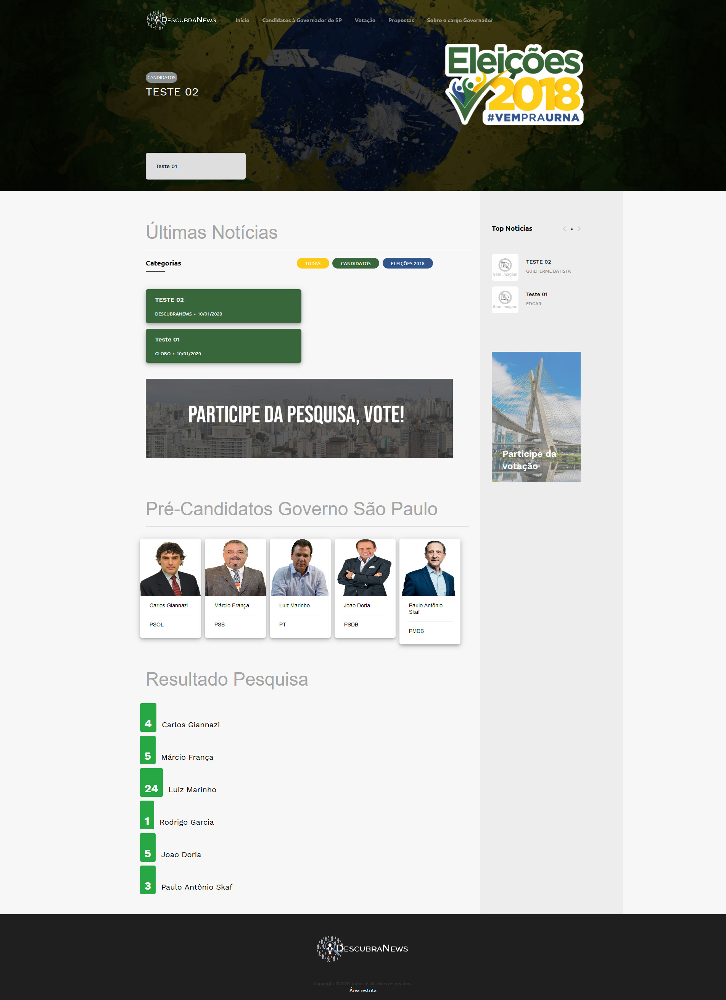
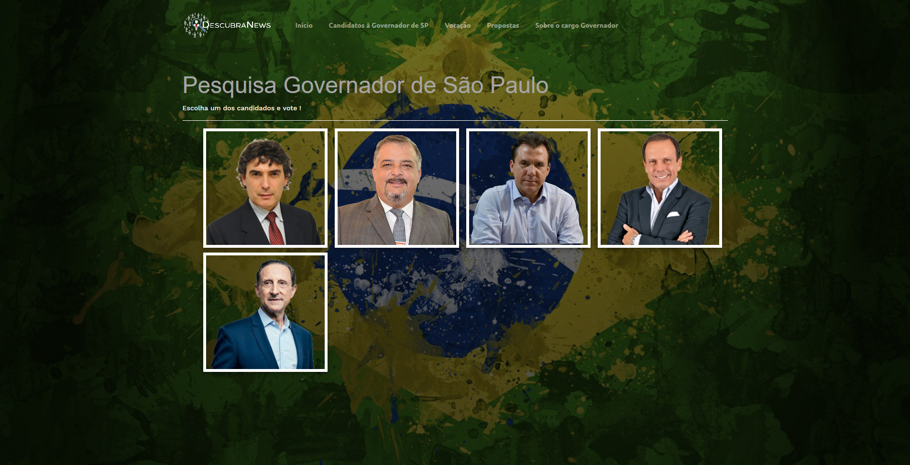
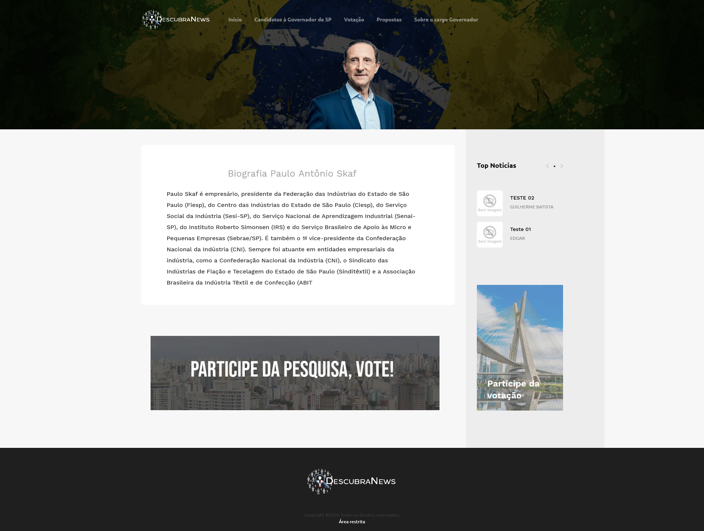
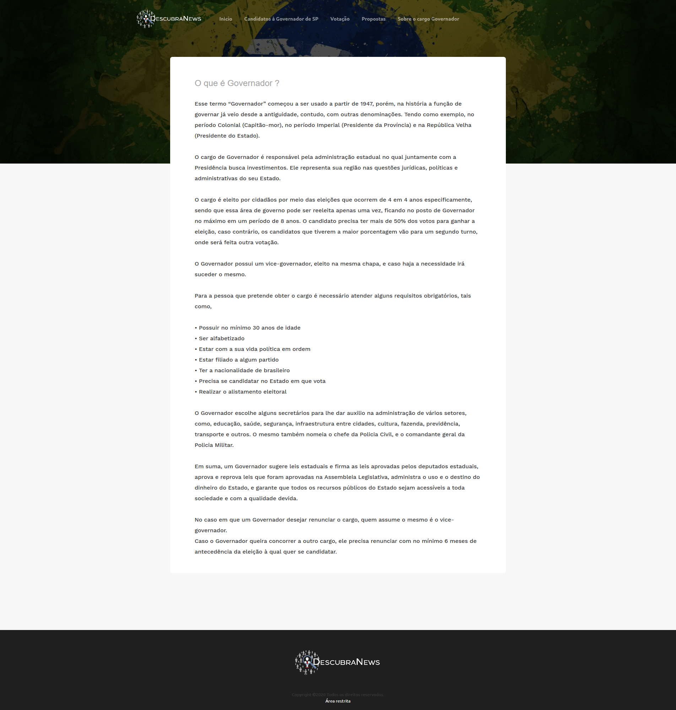
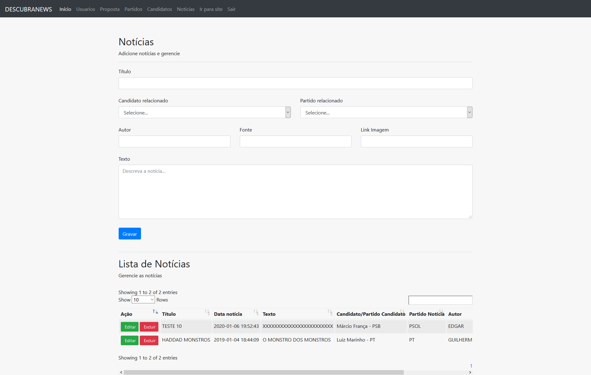

# DESCUBRANEWS #

Portal desenvolvido durante período acadêmico na faculdade das Américas (FAM), onde fomos desafiados pela professora Gabriela Oliveira Biondi (https://www.linkedin.com/in/gabriela-oliveira-biondi-7820a840/), a realizar a listagem de notícias usando o PHP e MYSQL, felizmente eu e meu grupo não nos contentamos em apenas “Listar” de forma rude as notícias, fomos além...

Desenvolvemoss o CRUD completo de um portal de notícias totalmente dinâmico pronto a ser colocado em produção para qualquer agência, segue abaixo prints do sistema, e fique a vontade para debulhar esse código, mas lembre-se, “Quem cola, não sai da escola”!

Principais tecnologia utiliazadas: PHP, HTML, CSS, BOOTSTRAP, JAVASCRIPT, JQUERY 

#Principal

#Votação

#Candidato

#Governador

#Administrador

